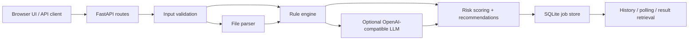

# Architecture

## Current implementation

- **Presentation layer**: server-rendered HTML + vanilla JS
- **API layer**: FastAPI routers
- **File parsing**: TXT, MD, DOCX, PDF
- **Risk engine**: deterministic regex rule packs for ad copy and contracts
- **AI enrichment**: optional OpenAI-compatible chat completions endpoint
- **Persistence**: SQLite for single-tenant or early production use

## Upgrade path

1. Replace SQLite with PostgreSQL.
2. Move file storage to S3-compatible object storage.
3. Add a background queue (Celery / Dramatiq / RQ).
4. Add auth, organizations, and tenant isolation.
5. Add export, reviewer workflows, and audit logs.
